# Usage Guide

## 1. Introduction

Charlie's Sneakers is an e-commerce web application for browsing and purchasing Air Jordan sneakers. The app lets users view product categories, inspect product details, register an account, log in, add products to a cart, and complete a simulated checkout flow.

Target users:

- Customers interested in Air Jordan sneakers in Costa Rica.
- Visitors who want to browse Low, Mid, High, and special collection products.
- Registered users who want to keep a shopping cart and complete checkout.

Main features:

- Home page with recent launches, highlighted categories, FAQ, community comments, and a community forum preview.
- Product category pages for Air Jordan Low, Mid, High, and special collection models.
- Product detail page with color variants, thumbnail previews, size selection, and size guide modal.
- Shopping cart with item summary, quantity totals, shipping cost, and remove confirmation.
- User registration and login using browser `localStorage`.
- Profile page for logged-in users.
- Simulated payment form and purchase confirmation page.
- Contact form, privacy notice, password recovery validation, and static forum page.

## 2. System Requirements

Supported browsers:

- The project is built with Vue 3 and Vite, so modern browsers such as Chrome, Edge, Firefox, and Safari should be supported.

Internet connection:

- Not required for now, since the app runs locally. This also means dependencies need to be installed, and that the product data and images are bundled in the repo.

Login requirements:

- Browsing products does not require login.
- Adding products to the cart does not require login.
- Proceeding from the cart to checkout requires a logged-in user.
  - Once logged in, the guest cart items are merged into the user's cart.
- User accounts are stored locally in the browser under `localStorage`, not in a remote database.

Local development requirements:

- Node.js `^20.19.0` or `>=22.12.0`.
- `npm`, or alternatives like `pnpm` if there are any lasting security concerns about `npm`.

## 3. Getting Started

### Accessing the Application

For local use:

1. Install dependencies:

   ```sh
   npm install
   ```

2. Start the development server:

   ```sh
   npm run dev
   ```

3. Open the URL shown by Vite in the terminal, usually `http://localhost:5173/`.

### First Steps as a User

1. Open the home page.
2. Browse products using the navigation bar: `Home`, `Low`, `Mid`, `High`, or `Coleccion`.
3. Select a product card to open its detail page.
4. Choose a color variant and size.
5. Add the product to the cart.
6. Register or log in before proceeding to checkout.

## 4. Main Features

### Home Page

The home page introduces the Charlie's Sneakers store and includes:

- A hero section for special collections.
- A carousel of recent launches.
- Featured category cards for Low, Mid, High, and special collection products.
- FAQ entries about shipping, size changes, and payment methods.
- A community forum preview.
- A community comments form.

To use it:

1. Open the home page at `/`.
2. Use the carousel to view recent launches.
3. Use the navigation bar or category cards to navigate to product categories.
4. Use the `Comprar Coleccion` button to go directly to the special collection page.
5. Expand FAQ questions to read answers.
6. Fill the community comment form with a name and comment if needed.

### Browsing Products

The app has four product browsing pages:

- `/low`: Air Jordan Low products.
- `/mid`: Air Jordan Mid products.
- `/high`: Air Jordan High products.
- `/coleccion`: limited and special collection products.

Available categories and examples:

- Air Jordan Low: Air Jordan 1 Low, Air Jordan 1 Low G, Air Jordan 1 Low SE, Air Jordan 1 Skyline Low.
- Air Jordan Mid: Air Jordan 1 Mid, Air Jordan 1 Mid SE, Air Jordan 1 Mid SE Edge.
- Air Jordan High: Air Jordan 1 Retro High OG, Air Jordan 1 Retro High 9.
- Special Collection: Air Jordan 3 Retro Sail and Jade Aura, Air Jordan 9 Retro Flit Grey and French Blue, Air Jordan MVP 92, Air Jordan Spizike.

To browse:

1. Choose a category from the navigation bar or click a category card on the home page.
2. Review the product cards and prices.
3. Click a product card to open the product detail page.

### Product Details

The product detail page is available at `/producto/:id`.

The page includes:

- Product name.
- Product price in Costa Rican colones.
- Main product image.
- Thumbnail previews.
- Color variant swatches.
- Size selector.
- Size guide modal.
- Add to cart button.

To add a product:

1. Open a product detail page.
2. Choose a color variant if multiple variants are available.
3. Select a size.
4. Click `Anadir al carrito`.

Important behavior:

- The add-to-cart button is disabled until a size is selected.
- When a product is added, the button temporarily changes to an added confirmation state.

### Shopping Cart

The shopping cart is available at `/carrito`.

The cart displays:

- Product image.
- Product name.
- Selected size and color when available.
- Quantity.
- Unit price.
- Line total.
- Subtotal.
- Shipping cost.
- Final total.

Shipping:

- Shipping is `CRC 10,000` when the cart has at least one product.
- Shipping is `CRC 0` when the cart is empty.

To use the cart:

1. Click the cart icon in the header.
2. Review the selected products.
3. Click the remove button for an item if needed.
4. Confirm removal in the modal.
5. Click `Continuar Comprando` to return to the store.
6. Click the checkout button to proceed.

Important behavior:

- If the cart is empty, checkout is disabled.
- If the user is not logged in, the checkout button sends the user to the login page.
- If the user is logged in, the checkout button sends the user to `/checkout`.
- Guest cart items are merged into the user's cart after login.

### User Registration

The registration page is available at `/registro`.

Required fields:

- Full name.
- Email.
- Phone number.
- Password.
- Password confirmation.
- Terms and conditions checkbox.

Validation rules found in the code:

- Name must have at least 3 characters.
- Email must use a valid email format and must not already be registered.
- Phone must be 8 to 15 characters and may contain digits, spaces, `+`, or `-`.
- Password must have at least 16 characters.
- Password must include lowercase, uppercase, number, and special character.
- Password confirmation must match.
- Terms and conditions must be accepted.

Storage:

- Registered users are saved in `localStorage` under the key `users_data`.
- Passwords are stored using PBKDF2 hashing with salt.

### Login and Logout

The login page is available at `/login`.

To log in:

1. Enter the registered email.
2. Enter the password.
3. Click `Iniciar Sesion`.

After a successful login:

- The user session is saved in `localStorage`.
- The app shows a welcome alert.
- The header changes from the login link to a user menu.

The user menu includes:

- `Ver perfil`.
- `Cerrar sesion`.

Session note:

- The app expires the session after 15 minutes of inactivity.
- The app also expires the session after a maximum duration of 1 hour.
- The current user is stored in `localStorage` under `current_user`.
- The session start timestamp is stored under `sessionStart`.

### User Profile

The profile page is available at `/perfil`.

If the user is logged in, the profile displays:

- Full name.
- Email.
- Phone number.
- Registration date.
- Purchase history.

If the user is not logged in, the page asks the user to log in first.

### Password Recovery

The password recovery page is available at `/recuperar-contrasena`.

The page includes an email field and validates that the email has a valid format.

### Checkout Process

The checkout page is available at `/checkout`.

The checkout page includes:

- Payment form.
- Order summary.
- Subtotal.
- Shipping.
- Total.

Payment fields:

- Name on card.
- Card number.
- Expiration date.
- CVC.

Validation rules:

- Name must contain only letters and be at least 3 characters.
- Card number must contain 16 digits.
- Expiration date must use `MM/YY` format and must not be expired.
- CVC must contain 3 or 4 digits.

To complete checkout:

1. Add at least one product to the cart.
2. Log in.
3. Open the cart.
4. Click `Proceder al Pago`.
5. Fill in valid payment information.
6. Click the payment button.
7. After validation, the cart is cleared and the app redirects to `/checkout/confirmado`.

Important note:

- Checkout is simulated on the client side.
- The app does not connect to a real payment processor.
- No real order is stored in a backend database.

### Purchase Confirmation

After a successful simulated payment, the app displays:

- `Pago confirmado`.
- The total amount paid.
- A link to return to the home page.

### Contact Page

The contact page is available at `/contacto`.

The form includes:

- Full name.
- Email.
- Phone.
- Subject.
- Message.

Validation rules:

- Name must have at least 3 characters.
- Email must use a valid email format.
- Phone is optional, but if provided must be 8 to 15 characters.
- Subject must have at least 5 characters.
- Message must have at least 10 characters.

Important limitation:

- The contact form shows a success alert, but the code does not send the message to an email address or server.

Contact information shown in the app:

- Phone: `+506 1234-5678`
- Email: `charliessneakers@cr.com`
- Address: `Santo Domingo, Heredia, Costa Rica`
- Hours: Monday to Friday, 9:00 AM to 6:00 PM; Saturday, 10:00 AM to 4:00 PM; Sunday closed.

### Community Forum

The forum page is available at `/foro`.

The page shows static forum categories:

- Release news.
- Care and cleaning.
- Buying and resale.

Important limitation:

- The forum page is informational/static in the current code.
- The code does not include posting, replies, or persistent forum data.

### Privacy Notice

The privacy notice is available at `/privacidad`.

It explains:

- Information collected.
- Use of information.
- Security.
- Sharing information.
- Cookies.
- User rights.
- Contact details.

## 5. Screenshots

### Figure 1: Home Page

The home page introduces Charlie's Sneakers, shows recent launches, highlights product categories, and provides access to the community and FAQ sections.

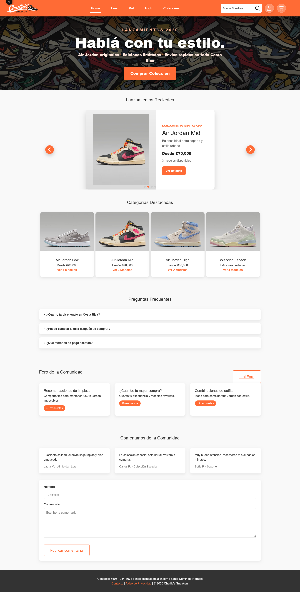

### Figure 2: Product Category Page

Category pages let users browse available sneaker models by section, such as Low, Mid, High, or special collection products.

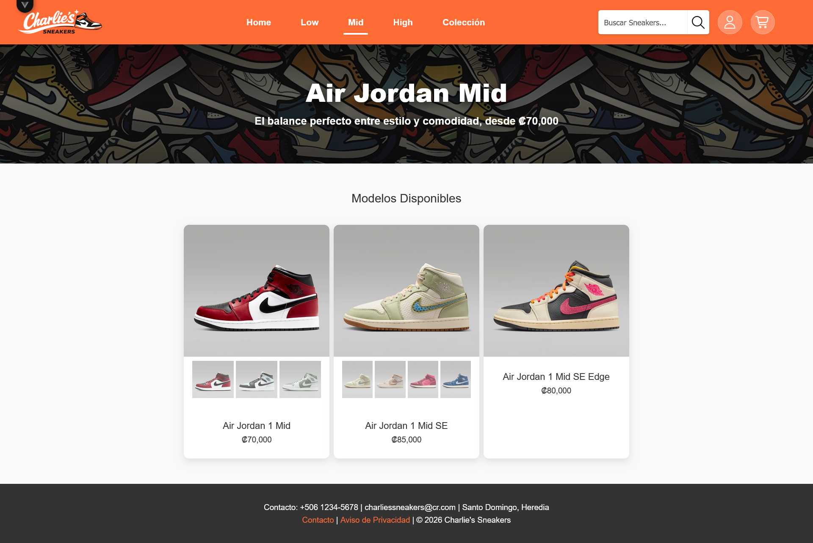

### Figure 3: Product Details Page

The product details page shows product images, color options, price, size selection, size guide access, and the add-to-cart button.

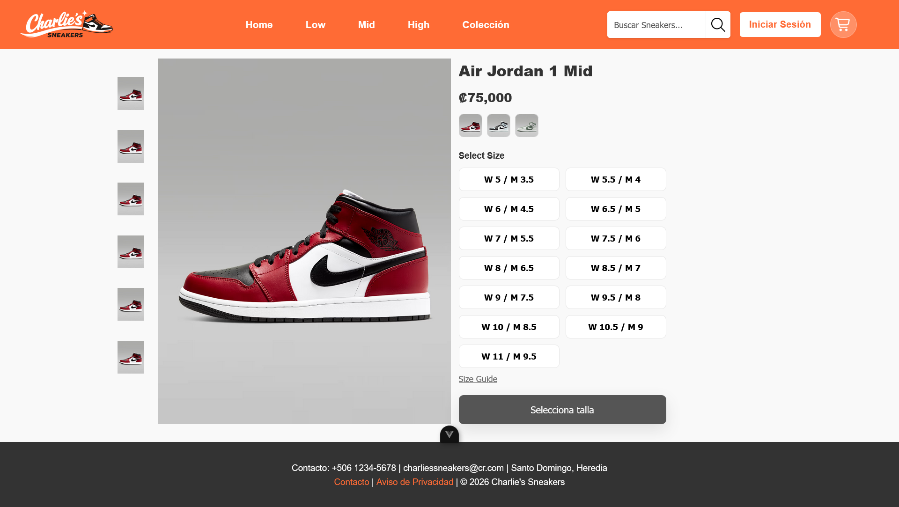

### Figure 4: Shopping Cart as Guest

The cart displays selected products, quantities, prices, shipping, subtotal, and total. When the user is not logged in, the checkout action prompts the user to log in.

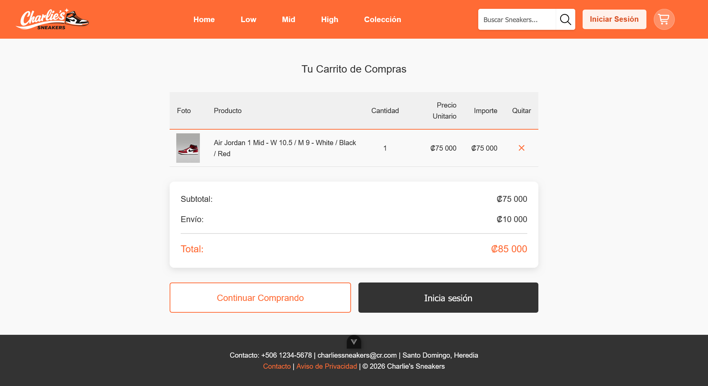

### Figure 5: Login Page

The login page validates registered user credentials and gives access to account-specific features such as checkout and profile information.

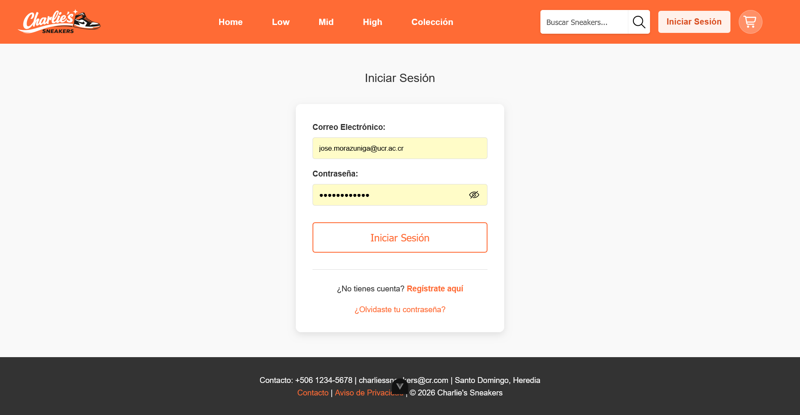

### Figure 6: Registration Page

The registration page lets new users create an account by entering personal information, a valid password, and accepting the terms and conditions.

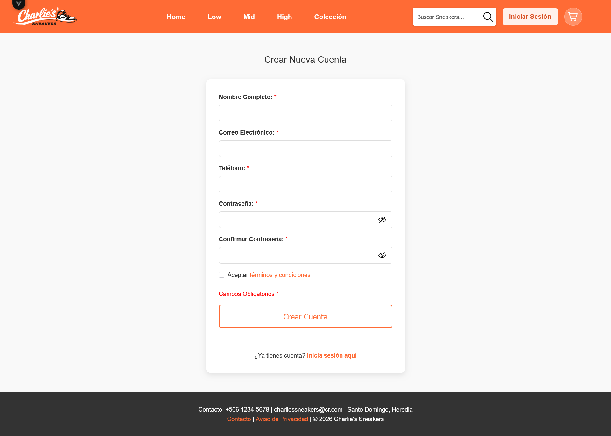

### Figure 7: Shopping Cart as Logged-In User

After logging in, the cart allows the user to proceed to the payment flow.

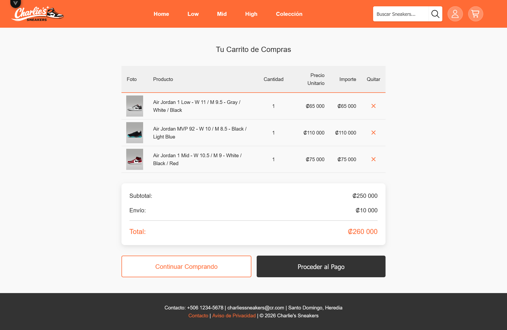

### Figure 8: Checkout Page

The checkout page collects simulated payment information and displays the order summary before confirming the purchase.

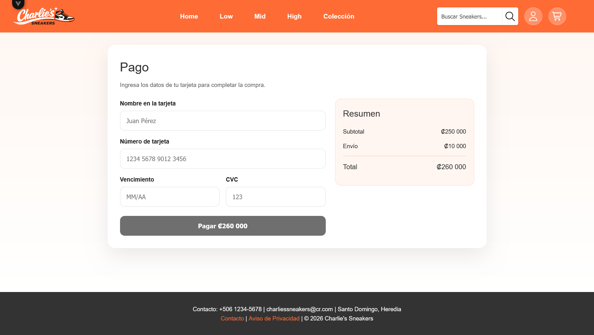

### Figure 9: Purchase Confirmation Page

After a successful simulated payment, the confirmation page displays the purchase status and the amount paid.

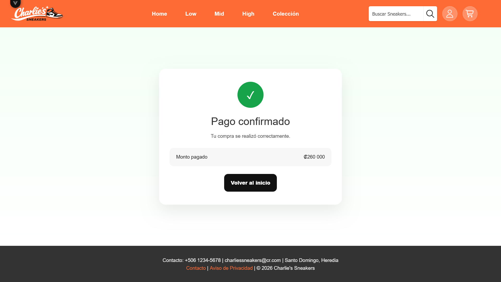

### Figure 10: User Profile Page

The profile page displays the logged-in user's registered account information and purchase history.

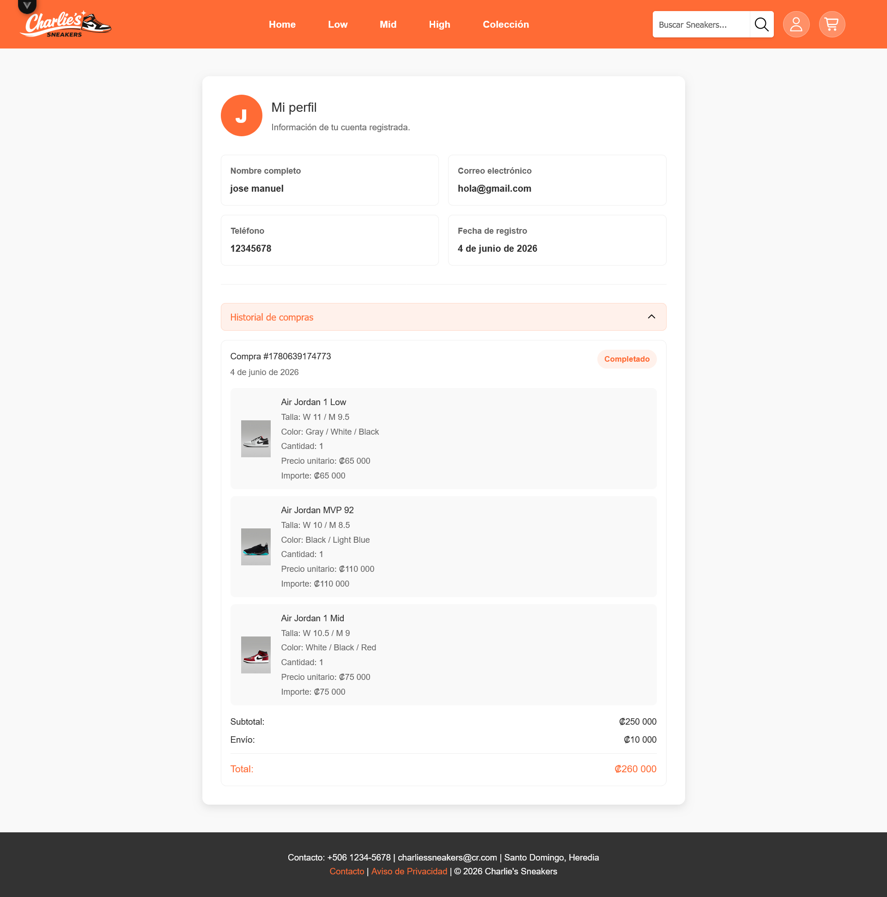

### Figure 11: Contact Page

The contact page includes a validated contact form and the store's contact information.

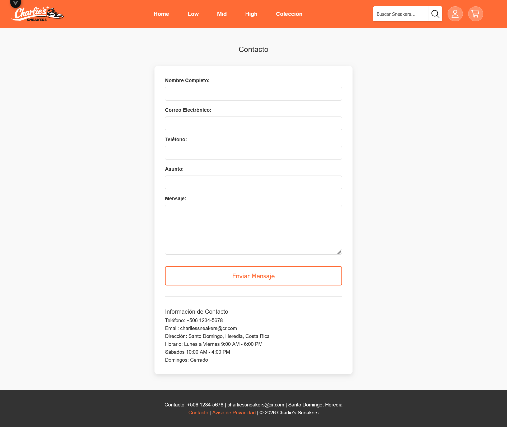

## 6. Common Issues / FAQ

**Q: I cannot proceed to checkout.**  
A: Make sure the cart has at least one product and that you are logged in.

**Q: The add-to-cart button says `Selecciona talla`.**  
A: Select a shoe size on the product detail page before adding the product.

**Q: My cart changed after logging in.**  
A: Guest cart items are merged with the logged-in user's cart when the session starts.

**Q: I cannot register because my password is rejected.**  
A: Use at least 16 characters, including uppercase, lowercase, number, and special character.

**Q: The payment button is disabled.**  
A: Check that the cart has products and that all payment fields pass validation.

**Q: Does the app charge a real payment card?**  
A: No. The checkout flow is simulated in the browser.

## 7. Known Limitations

- There is no backend nor database.
- Users are stored in browser `localStorage`.
- Carts are stored in browser `localStorage`.
- Checkout is simulated and does not process real payments.
- Contact and password recovery forms validate email but do not send real mail.
- The forum page and community features are static.
- Search does not currently filter the product catalog.

## 8. Conclusion

Charlie's Sneakers provides a functional front-end shopping experience for Air Jordan products. A user can browse product categories, inspect product details, select size and color, add products to a cart, register and log in, complete a simulated checkout, and view a purchase confirmation.
